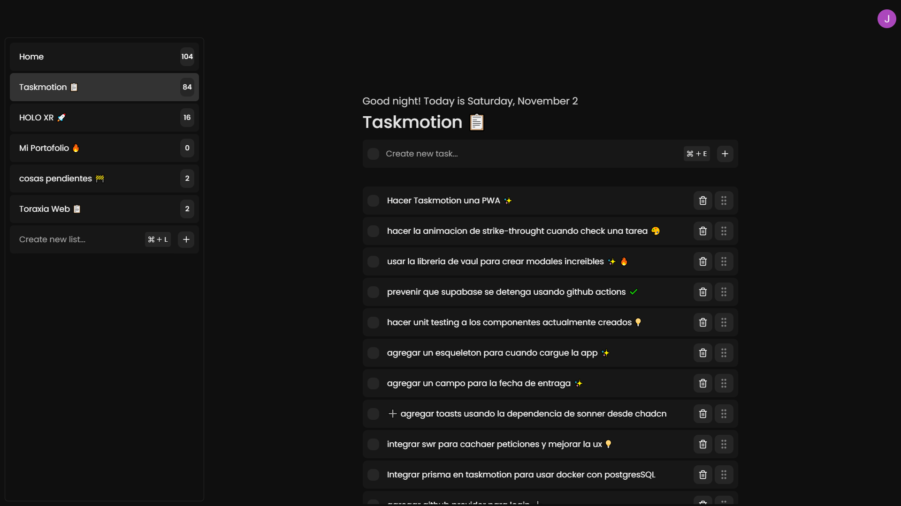

# Taskmotion

This is a task management project developed using React for the frontend and Node.js for the backend. We have integrated Honojs as our server framework, Supabase as our database.

## Technologies Used

- **React**: JavaScript library for building user interfaces.
- **Node.js**: JavaScript runtime environment for the backend.
- **Honojs**: Minimalist framework for building web servers in Node.js.
- **Supabase**: Platform providing Postgres database, authentication, and real-time functionalities.
- **Tailwind CSS**: Utility-first CSS framework for rapidly building custom designs.
- **Zustand**: State management library for React applications.
- **Chadcn/ui**: React component library for creating beautiful and accessible UIs.

## Monorepo Setup

We use pnpm with workspaces to manage this project as a monorepo, facilitating easier dependency management and development workflows.

## Contributing

1. Fork the repository.
2. Create a new branch (`git checkout -b feature-new-feature`).
3. Make your changes and commit them (`git commit -am 'Add new feature'`).
4. Push to the branch (`git push origin feature-new-feature`).
5. Create a Pull Request.

## License

#### This project is licensed under the MIT License. For more details, see the [LICENSE](LICENSE) file.

